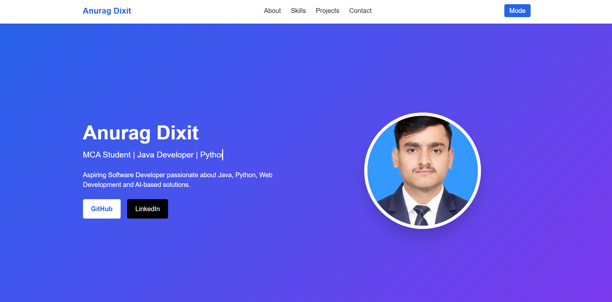

# Day 10 Challenge – Personal Portfolio Website

## Objective

Build and enhance a personal portfolio website using HTML, CSS, and JavaScript.

## Project Overview

Created a responsive personal portfolio website showcasing personal information, skills, projects, education, and contact details. The website was developed using HTML, CSS, and JavaScript and designed to provide a professional online presence.

## Files Included

* portfolio.html (Portfolio Website Source Code)
* Screenshots of the Portfolio Website
* day10.md

## Portfolio HTML File

The [Original HTML](day10-portfolio.html) file contains the complete structure of the portfolio website, including:

* Hero Section
* About Me Section
* Skills Section
* Projects Section
* Education Section
* Contact Section
* Social Media Links
* Responsive Layout

## Features Implemented

* Responsive Design
* Hero Section
* About Me Section
* Skills Section
* Projects Section
* Education Section
* Contact Information
* Social Media Links
* Professional UI Design

## Learnings

* Improved HTML structure and semantic tags.
* Enhanced webpage styling using CSS.
* Learned responsive design techniques.
* Practiced organizing project files in GitHub.
* Improved portfolio presentation skills.
* Gained experience in creating a professional portfolio website.

## Screenshots

## Outcome

Successfully created and enhanced a professional portfolio website, uploaded the `portfolio.html` file, added project screenshots, documented learnings, and pushed all files to GitHub.
