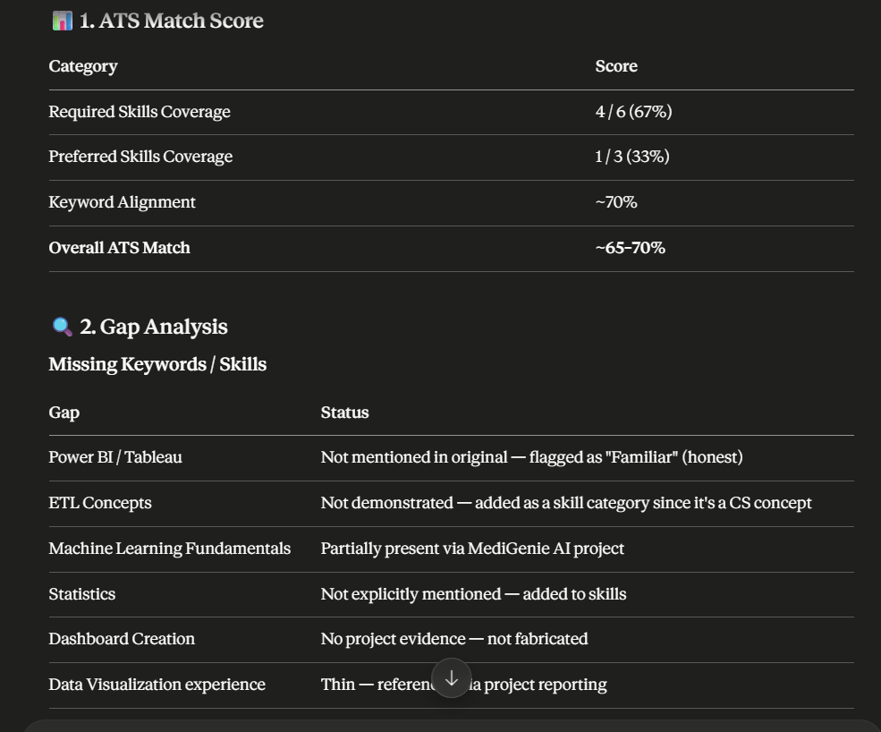
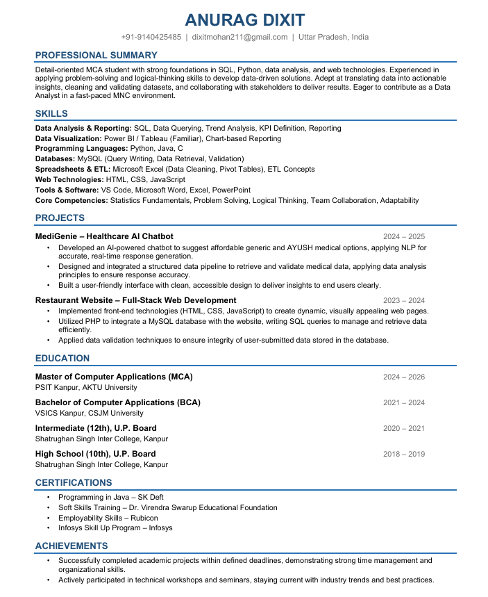

# Day 11 Challenge

## ATS Resume Analysis

Completed ATS analysis of my resume and identified areas for improvement.

## Resume Optimization

Updated resume with:
- Better keywords
- Improved formatting
- Enhanced project descriptions
- ATS-friendly structure

## Learnings

- Importance of ATS keywords
- Resume formatting best practices
- How recruiters screen resumes
- Optimizing project descriptions for better visibility

## Files Included

- ATS Analysis Report 
- Optimized Resume 
  
