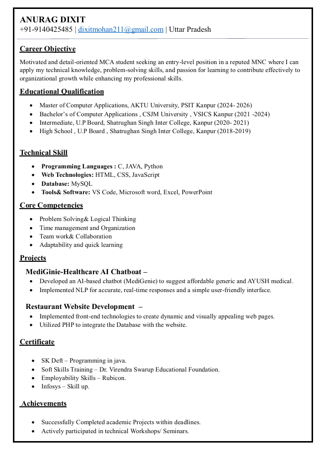
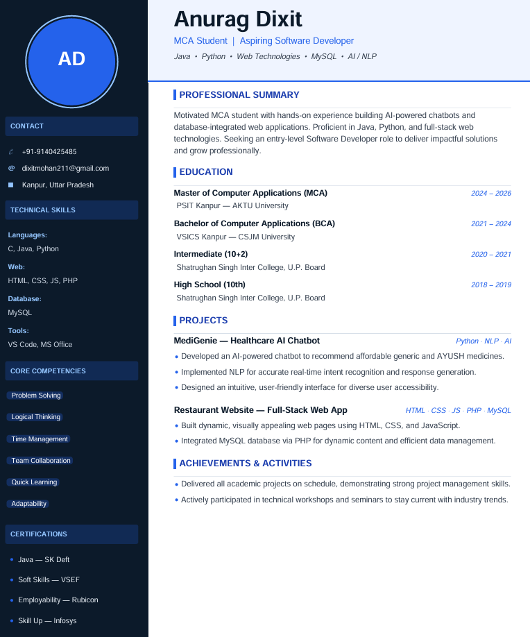
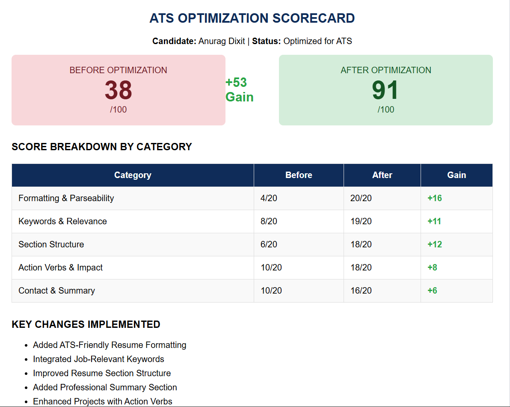

# Day 6 – Resume Optimization with AI

## Objective

Learn how AI can be used to analyze, improve, and optimize a resume for better ATS (Applicant Tracking System) performance and recruiter visibility.

---

## Original Resume

### Screenshot

---

## Optimized Resume

### Screenshot

---

## ATS Optimization Scorecard

### Screenshot

---

## Key Changes Implemented

* Added ATS-friendly resume formatting
* Improved resume section hierarchy
* Added a professional summary
* Integrated role-specific keywords
* Enhanced project descriptions with action verbs
* Improved keyword density and readability
* Optimized skills section for ATS parsing

---

## ATS Score Improvement

| Category                  | Before | After |
| ------------------------- | ------ | ----- |
| Formatting & Parseability | 4/20   | 20/20 |
| Keywords & Relevance      | 8/20   | 19/20 |
| Section Structure         | 6/20   | 18/20 |
| Action Verbs & Impact     | 10/20  | 18/20 |
| Contact & Summary         | 10/20  | 16/20 |

**Overall ATS Score:** 38/100 → 91/100

---

## Key Learnings

1. ATS systems prioritize keyword matching and proper formatting.
2. A clean and structured resume improves parsing accuracy.
3. Action-oriented bullet points create stronger impact.
4. Relevant technical skills and keywords increase visibility.
5. Professional summaries help recruiters quickly understand a candidate profile.
6. AI tools can significantly improve resume quality and ATS performance.

---

## Conclusion

This exercise demonstrated how AI-assisted resume optimization can improve ATS compatibility, recruiter visibility, and overall resume effectiveness. The optimized resume achieved a significant increase in ATS score and better alignment with industry standards.
