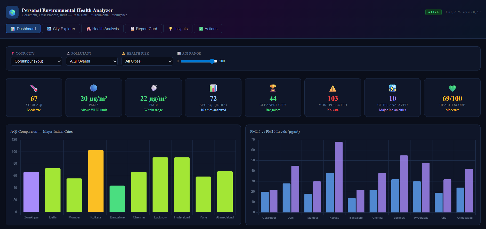
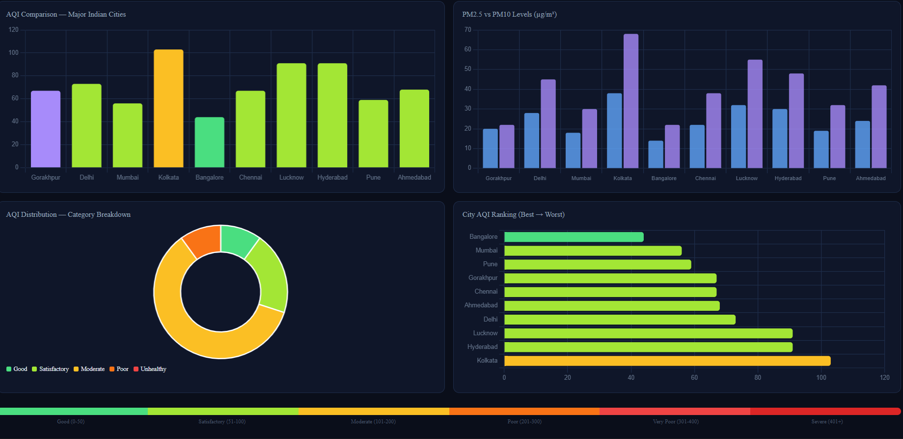

# Day 8 - HTML Generation Challenge

## Screenshots

### Screenshot 1

### Screenshot 2

---

## Learnings

- Learned how AI can generate HTML code.
- Understood HTML structure and elements.
- Practiced converting requirements into web page layouts.

---

## Observations

- AI speeds up frontend development.
- Proper prompts generate better HTML output.
- Reviewing generated code is important.
