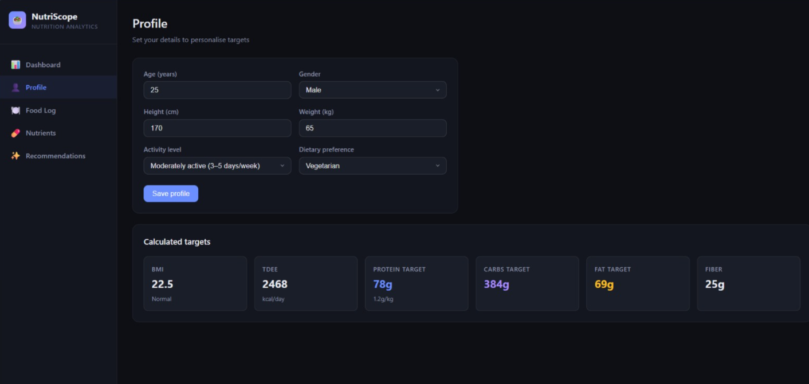
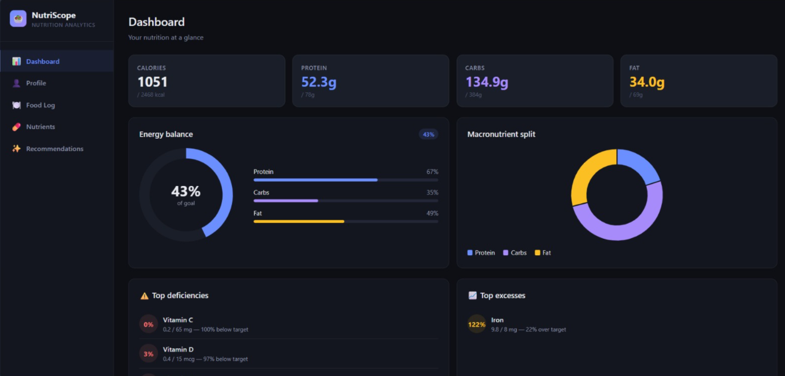
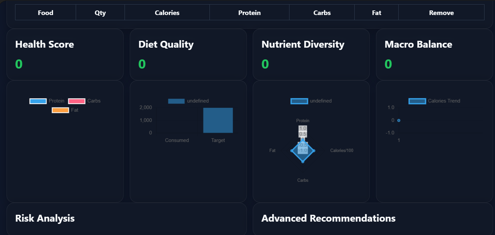
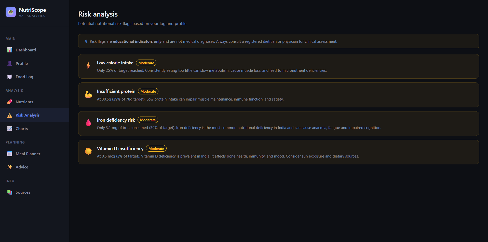

# Day 9 – NutriScope Enhancement Challenge

## Objective

Enhance an existing NutriScope nutrition analysis application by adding advanced features while maintaining the original user interface and user experience.

---

## Files Included

### HTML Files

* [day9-nutriscope-original.html](nutriscope-original.html)
* [day9-nutriscope-enhanced.html](nutriscope-enhanced.html)

### Screenshots

* 
* 
* 
* 

---

## Features Added

### 1. CSV Upload

Users can upload CSV files containing nutrition data for analysis.

### 2. Expanded Food Database

Added 40+ additional food items to improve nutritional coverage.

### 3. Additional Micronutrients

Included:

* Vitamin A
* Vitamin C
* Vitamin D
* Vitamin E
* Vitamin K
* Calcium
* Iron
* Magnesium
* Potassium
* Zinc

### 4. Two-Day Meal Planner

Generated personalized meal plans covering two days.

### 5. Risk Analysis

Provided nutritional risk indicators such as:

* High sodium intake
* High sugar consumption
* Excess calories
* Nutrient deficiencies

### 6. Educational Disclaimer

Added guidance that results are informational and not medical advice.

### 7. Nutrition Sources

Included trusted nutrition references and data sources.

### 8. Improved Charts

Enhanced data visualization for better interpretation of nutrition metrics.

### 9. Advanced Recommendations

Generated personalized recommendations based on nutritional analysis.

---

## Comparison Notes

| Original Version        | Enhanced Version             |
| ----------------------- | ---------------------------- |
| Basic food database     | Expanded food database       |
| Limited nutrients       | Detailed micronutrients      |
| No CSV upload           | CSV upload support           |
| Basic analysis          | Advanced risk analysis       |
| No meal planning        | 2-day meal planner           |
| Limited recommendations | Personalized recommendations |
| Basic charts            | Enhanced visualizations      |

---

## Learnings

* Learned how to extend an existing web application without changing the UI design.
* Improved understanding of nutrition-related datasets.
* Practiced implementing CSV data processing.
* Learned how to provide actionable recommendations using analyzed data.
* Enhanced dashboard usability through better visualizations.
* Gained experience in feature enhancement while preserving user experience.

---

## Conclusion

The NutriScope application was successfully enhanced with advanced nutrition analysis, meal planning, risk assessment, and improved visualization features while maintaining the original interface design.
