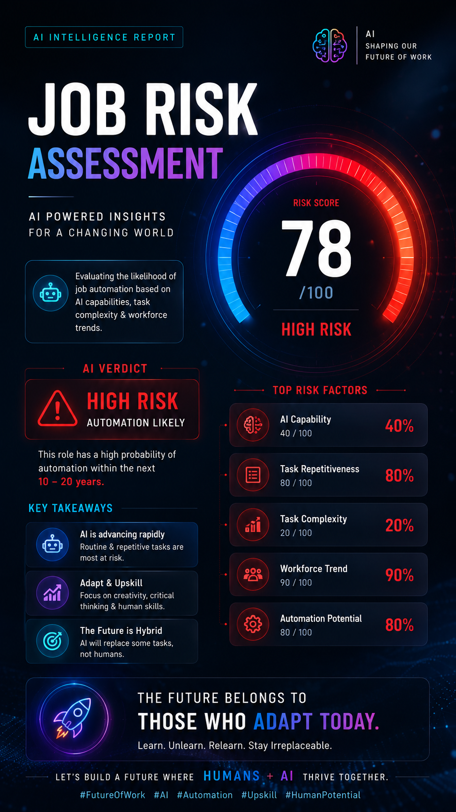
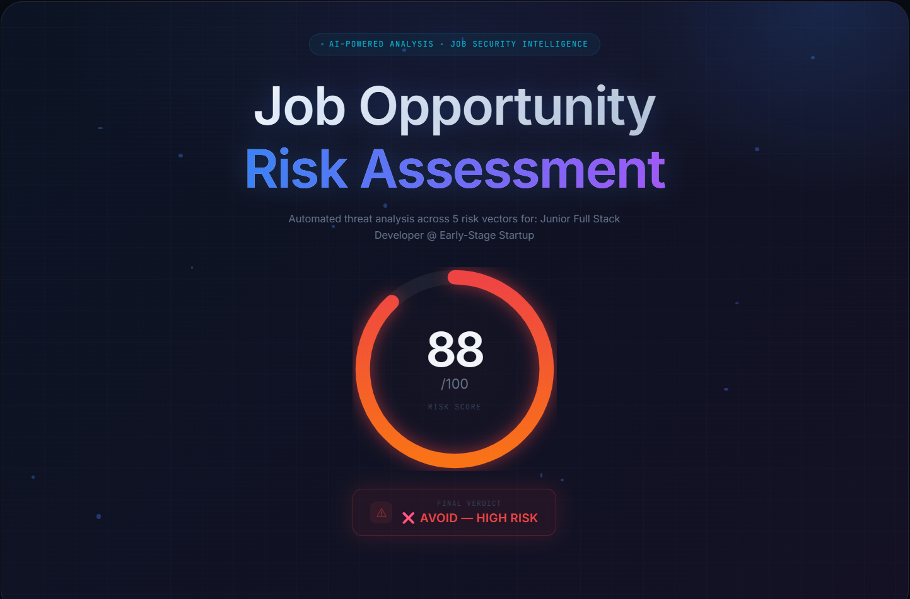
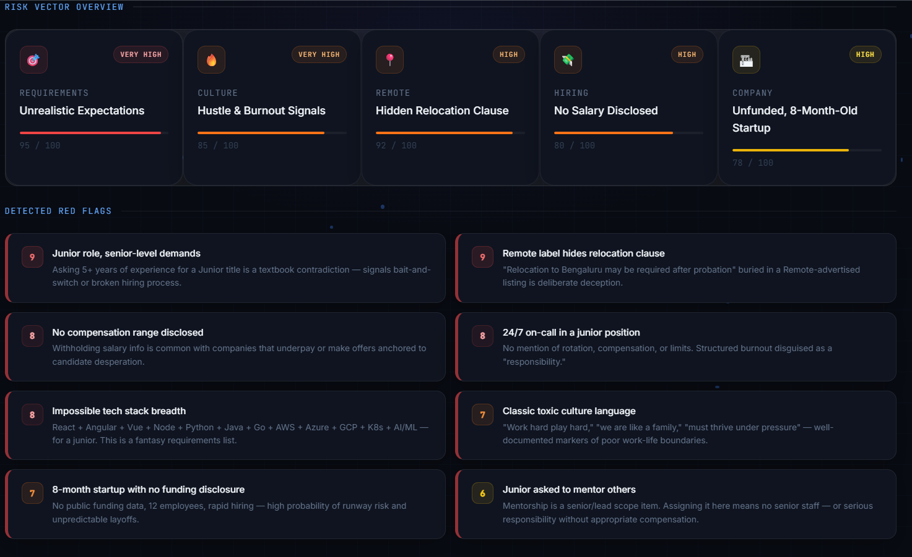

# Day 14 – AI Job Risk Assessment Dashboard

## Project Overview

Today, I built an AI-Powered Job Risk Assessment Dashboard that analyzes job opportunities and identifies potential risks such as unrealistic expectations, burnout culture, salary transparency issues, company stability, and remote-work authenticity.

## Screenshots

* Screenshot1- 
* Screenshot2- Risk Analysis Section 
* Screenshot3- Final Report View 

## Generated Report

The generated report provides a detailed risk assessment with a risk score, detected red flags, positive signals, and smart interview questions.

## Key Learnings

* Learned advanced dashboard design techniques.
* Improved HTML, CSS, and JavaScript skills.
* Implemented modern UI concepts such as glassmorphism and animations.
* Understood how AI can assist in evaluating job opportunities.
* Enhanced problem-solving and frontend development skills.

## Conclusion

This project helped me create a professional and interactive dashboard while strengthening my frontend development and UI/UX design skills.
