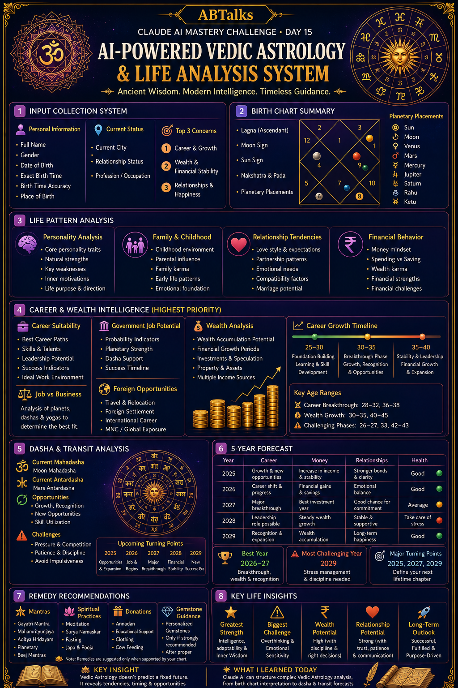
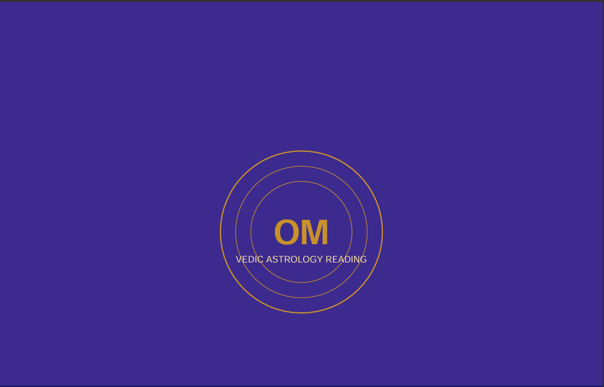
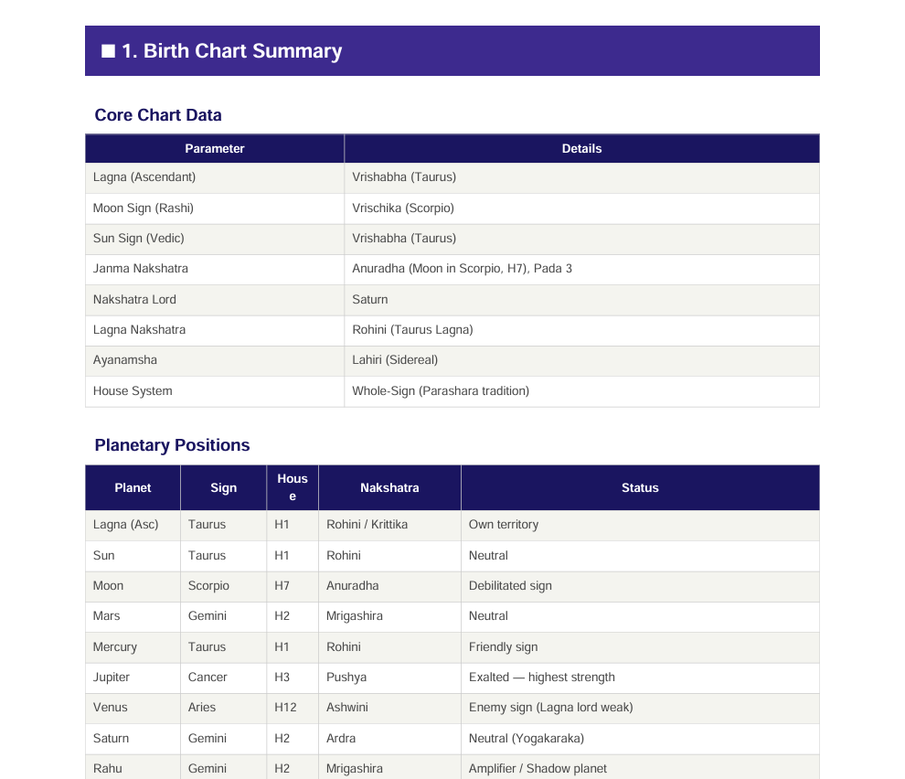
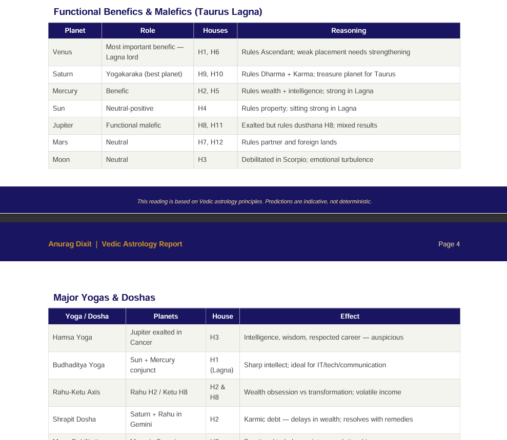

# Day 15 – Premium Astrology Report & Poster

## Project Title

AI-Powered Premium Vedic Astrology Report

## Home Page Screenshot

## Screenshots Added

1. Home Page Screenshot 
2. Astrology Report Screenshot 
3. Premium Poster Screenshot 

## Generated Reports

* Vedic Astrology Report (PDF)
* Premium 9:16 Astrology Infographic Poster

## Work Done

* Created a professional astrology report.
* Designed a premium infographic poster in 9:16 ratio.
* Added career, wealth, relationship, health, and spiritual insights.
* Improved visual presentation using premium colors, icons, and infographic elements.

## Key Learnings

* Learned how to create AI-generated reports.
* Improved infographic and poster design skills.
* Understood visual storytelling and report presentation.
* Learned how to organize project assets in GitHub.

## Outcome

Successfully created a premium astrology report and presentation-ready infographic poster with enhanced visual appeal.
