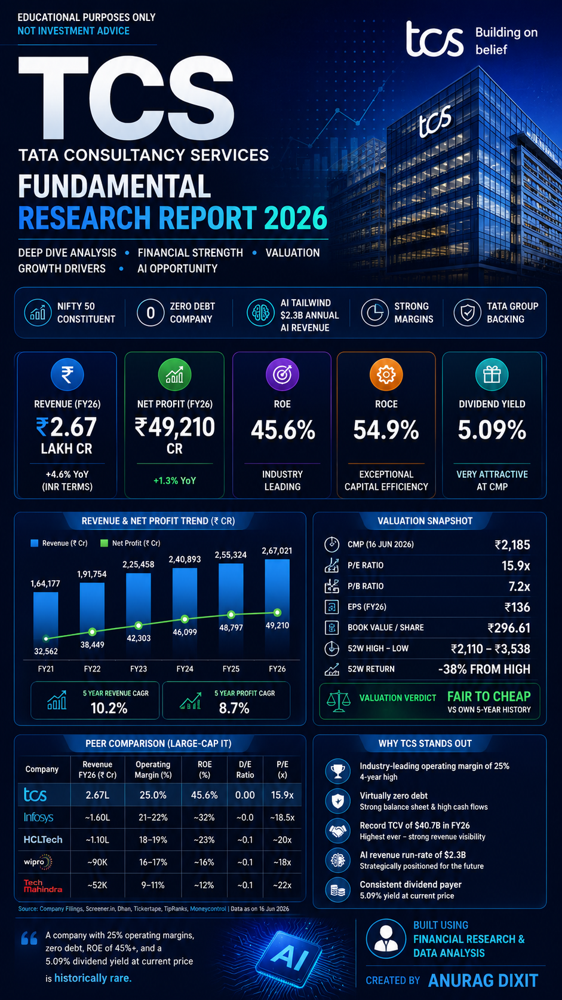
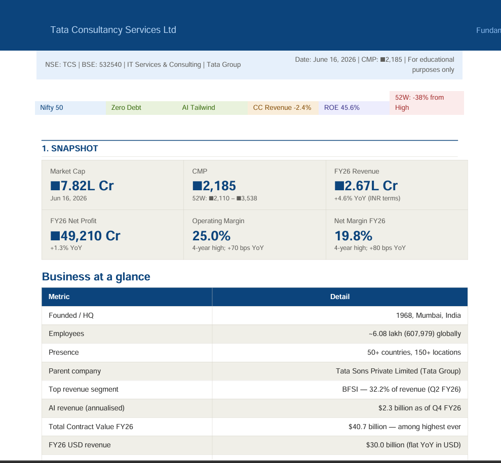
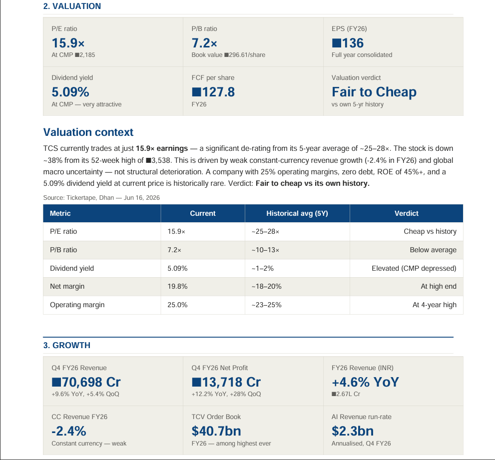

# Day 16 - Stock Research Dashboard & Report Generation

## Objective

Created professional stock research reports and LinkedIn-ready posters using AI tools and financial data analysis.

## Work Completed

* Generated a detailed TCS Fundamental Research Report.
* Created an enhanced PDF research report.
* Designed a LinkedIn poster for TCS in 9:16 format.
* Designed a LinkedIn poster for Infosys in 9:16 format.
* Analyzed key financial metrics such as Revenue, Net Profit, ROE, ROCE, Dividend Yield, and Valuation Ratios.
* Compared TCS and Infosys with other large-cap IT companies.

## Files Uploaded

* TCS LinkedIn Poster 
* TCS_Screenshot 1 
* TCS_Screenshot 2 
  

## Key Learnings

1. Understanding stock fundamental analysis.
2. Interpreting valuation metrics such as P/E and P/B ratios.
3. Evaluating profitability through ROE and ROCE.
4. Comparing companies using peer analysis.
5. Creating professional financial reports with AI.
6. Designing LinkedIn-ready financial research posters.
7. Presenting complex financial data in a visually appealing format.

## Outcome

Successfully created research reports and professional social media assets that can be used for portfolio building, LinkedIn sharing, and financial analysis practice.
