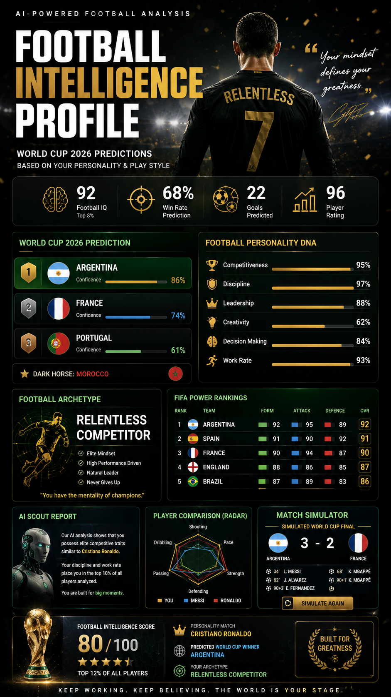

# Day 19 - Football Intelligence Profile Dashboard

## Objective

Created an interactive Football Intelligence Profile Dashboard using HTML, CSS, and JavaScript. The dashboard analyzes World Cup predictions, football awareness score, and Messi vs Ronaldo personality matching.

## Files Included

* football_intelligence_profile.html [Original HTML](day19-footballinyelligence.html)
* football poster 

## Features Implemented

* World Cup 2026 Prediction Report
* Players to Watch Section
* Football Awareness Score Analysis
* Interactive Personality Match (Messi vs Ronaldo)
* Radar Chart Visualization
* Responsive Modern UI Design
* Animated Progress Indicators

## Key Learnings

* Advanced HTML dashboard structuring
* CSS animations and transitions
* SVG-based charts and visualizations
* JavaScript DOM manipulation
* Interactive data presentation
* Responsive dashboard development
* User personality analysis visualization

## Output Summary

Successfully designed a premium football analytics dashboard featuring tournament predictions, awareness scoring, and personality-based football player matching with an engaging user experience.

## Conclusion

Day 19 helped strengthen frontend development skills through the creation of an interactive sports analytics dashboard combining design, visualization, and user engagement concepts.
