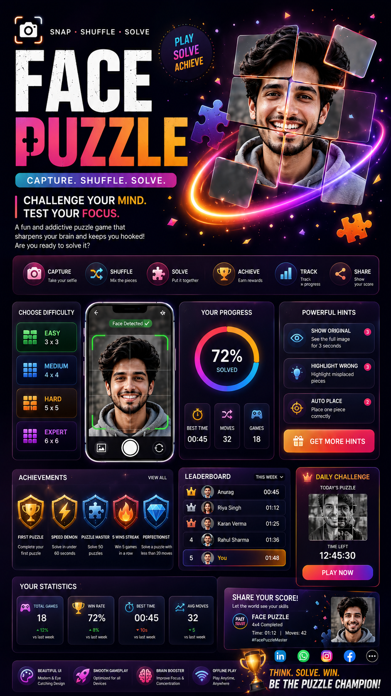

# Day 20 – Face Puzzle Analytics Dashboard

## Objective

Create a professional analytics dashboard for the Face Puzzle project to visualize game performance, user progress, and leaderboard statistics.

## Files Included

* FacePuzzle_Dashboard.html  [FacePuzzle HTML](day20-htmlfile.html)]
* Dashboard poster ]

## Features Implemented

* Premium Glassmorphism Dashboard UI
* Game Statistics Cards
* Best Time Tracking
* Win Rate Analytics
* Weekly Performance Chart
* Leaderboard Section
* Responsive Design
* Modern Dark Theme

## Screenshots

### Dashboard Overview

(Add Screenshot Here)

### Analytics Cards

(Add Screenshot Here)

### Leaderboard Section

(Add Screenshot Here)

## Key Learnings

* Improved dashboard UI design skills.
* Learned responsive card-based layouts.
* Practiced analytics visualization concepts.
* Enhanced CSS styling with glassmorphism effects.
* Created professional portfolio-ready dashboard interfaces.

## Challenges Faced

* Designing a responsive dashboard layout.
* Creating visually appealing analytics cards.
* Balancing performance and aesthetics.

## Outcome

Successfully developed a modern Face Puzzle Analytics Dashboard with performance metrics, leaderboard tracking, and an attractive user interface suitable for portfolio projects.

## GitHub Repository Structure

Day20/
├── day20.md
├── FacePuzzle_Dashboard.html
├── screenshots/
│   ├── dashboard-overview.png
│   ├── analytics-cards.png
│   └── leaderboard.png

## Conclusion

Day 20 focused on transforming a simple puzzle project into a professional analytics dashboard, improving both frontend design and UI/UX development skills.
