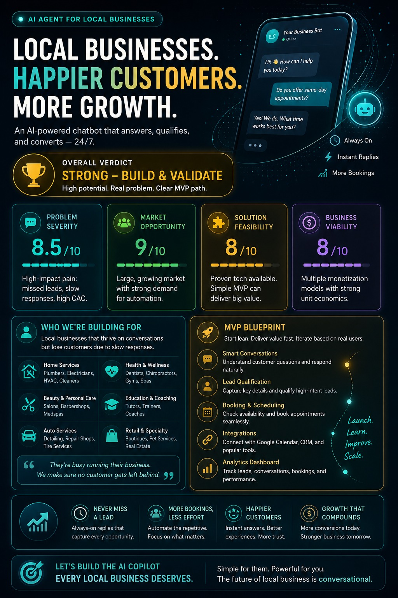

# Day 23 - AI Report Generation Challenge

## Objective

Learned how to generate structured reports using AI, organize information effectively, and present insights in a professional format.

## Tasks Completed

* Created and tested AI-generated report.
* Analyzed report structure and formatting.
* Improved readability and presentation of generated content.
* Reviewed accuracy and consistency of AI-generated information.
* Documented key observations and learnings.

## Files Included

* Generated Report and file - [Original HTML](day23-htmlfile.html)]
*  Poster of Report 

## Key Learnings

1. AI can generate professional reports quickly and efficiently.
2. Proper prompts significantly improve report quality.
3. Structured formatting enhances readability and presentation.
4. Fact-checking AI-generated content is important for accuracy.
5. AI-assisted reporting can save considerable time in documentation tasks.

## Challenges Faced

* Refining prompts for better report structure.
* Ensuring consistency in generated content.
* Organizing information in a clear and professional manner.

## Conclusion

Day 23 helped me understand how AI can be used for report generation and documentation. I learned prompt engineering techniques, report structuring, and methods to improve the quality of AI-generated outputs.
