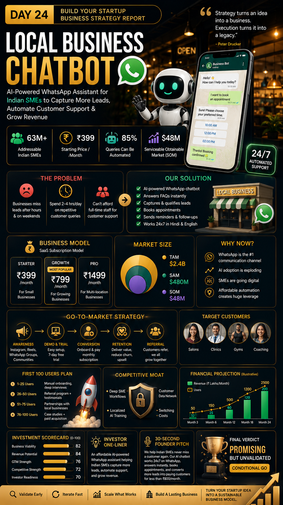

# Day 24 – Build Your Startup Business Strategy Report

## Objective

Transform a startup idea into a sustainable business model by creating a comprehensive Business Strategy Report.

## Startup Idea

**Local Business Chatbot**

An AI-powered WhatsApp assistant that helps Indian SMEs automate customer support, capture leads, schedule appointments, and increase customer engagement.

---

## Work Completed

### Business Reality Check

* Identified target customers and revenue sources.
* Evaluated monetization and growth risks.
* Analyzed key assumptions requiring validation.

### Business Model Canvas

* Customer Segments
* Value Proposition
* Channels
* Revenue Streams
* Key Activities
* Key Resources
* Cost Structure

### Revenue & Pricing Strategy

* Starter Plan: ₹399/month
* Growth Plan: ₹799/month
* Pro Plan: ₹1499/month

### Go-To-Market Strategy

* Instagram Marketing
* WhatsApp Communities
* Referral Programs
* Local Business Partnerships

### Customer Acquisition Strategy

* Free Trial Campaigns
* Direct Outreach
* Referral Loop
* Content Marketing

### First 100 Users Plan

* Manual onboarding
* Customer interviews
* Testimonials collection
* Referral-based growth

### Competitive Position & Moat

* WhatsApp-first approach
* Hindi + English support
* SME-focused workflows
* Localized AI automation

### Investment Scorecard

* Business Viability: 82/100
* Revenue Potential: 84/100
* GTM Strength: 76/100
* Competitive Strength: 72/100
* Investor Readiness: 70/100

Overall Score: **79/100**

Verdict: **🟡 Validate & Execute**

---

## Files Included

* Business Strategy Report # HTML Files- [ Business Strategy](day24-htmlfile.html)
* LinkedIn Poster -

---

## Key Learnings

1. Revenue is more important than vanity metrics.
2. Distribution is more critical than product features.
3. Customer acquisition determines startup success.
4. Strong retention creates sustainable growth.
5. Validation should happen before scaling.
6. A startup needs a repeatable business model.
7. Competitive advantages must be developed early.
8. Customer feedback drives product improvement.
9. Go-To-Market strategy is as important as product development.
10. Sustainable businesses focus on solving real problems.

---

## Outcome

Created a complete Startup Business Strategy Report and Investor Readiness Analysis for the Local Business Chatbot startup concept.
