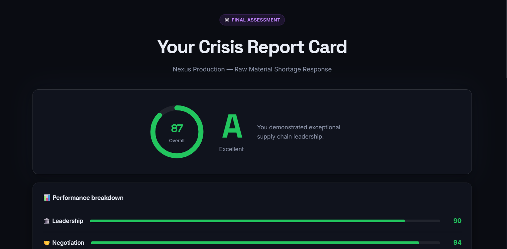
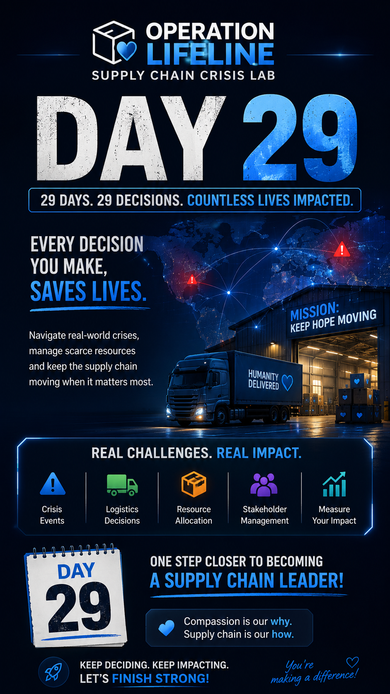

# Day 29 - Operation Lifeline: Supply Chain Crisis Lab

## 📅 Date

29 June 2026

## 📌 Project Title

**Operation Lifeline: Supply Chain Crisis Lab**

## 🎯 Objective

Developed an interactive supply chain crisis simulation that challenges users to make strategic business decisions during real-world disruptions. The project focuses on crisis management, leadership, supplier negotiation, and AI-driven supply chain optimization.

## 🚀 Features

* Interactive Supply Chain Crisis Simulation
* Dynamic Company & Crisis Generation
* War Room Decision Engine
* Supplier Negotiation Module
* CEO Leadership Decision Scenarios
* AI Strategy Recommendations
* Performance Dashboard & Final Score
* Premium Responsive UI/UX
* Built using HTML, CSS, JavaScript & React

## 🛠️ Technologies Used

* HTML5
* CSS3
* JavaScript (ES6)
* React.js (CDN)
* Responsive Design
* Modern UI/UX

## 📂 Files Included

* day29-htmlfile.html [Original HTML](day29-htmlfile.html)
* Project Screenshots 
* Projet Poster 
  

## 📖 Key Learnings

* Designing interactive business simulations
* Building complex multi-step workflows
* State management using React
* Dynamic UI rendering
* Supply Chain Crisis Management concepts
* Decision-based application development
* Responsive dashboard design
* Creating premium user experiences

## ✅ Outcome

Successfully built a premium Supply Chain Crisis Lab that demonstrates real-world decision making, business analytics, leadership skills, and modern frontend development techniques.
