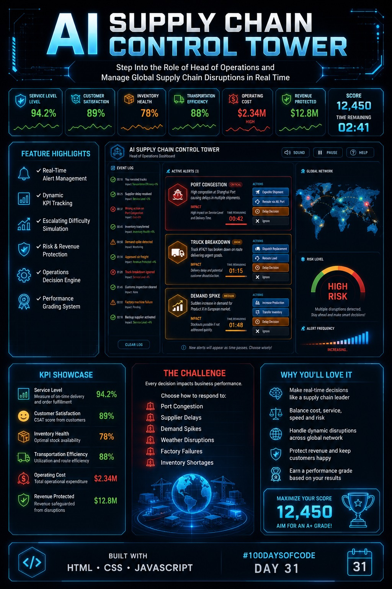

# Day 31 - HTML Project Documentation

## 📅 Date
01 July 2026

## 📌 Task Completed
- Created the Day31 folder.
- Developed the HTML project.
- Captured and uploaded project screenshots.
- Added the generated HTML file.
- Documented key learnings.
- Committed and pushed the project to GitHub.

## 📂 Files Included
- day31.html [Original HTML](day31-htmlfile.html)
- Screenshots 
- poster 

## 🚀 Key Learnings
- Improved HTML page structure and semantic elements.
- Practiced responsive layout techniques.
- Enhanced UI design and styling.
- Organized project files professionally.
- Strengthened Git and GitHub workflow.

## 🛠️ Technologies Used
- HTML5
- CSS3
- Git
- GitHub

## ✅ Outcome
Successfully completed Day 31 challenge by building the project, documenting the work, and pushing it to GitHub.
