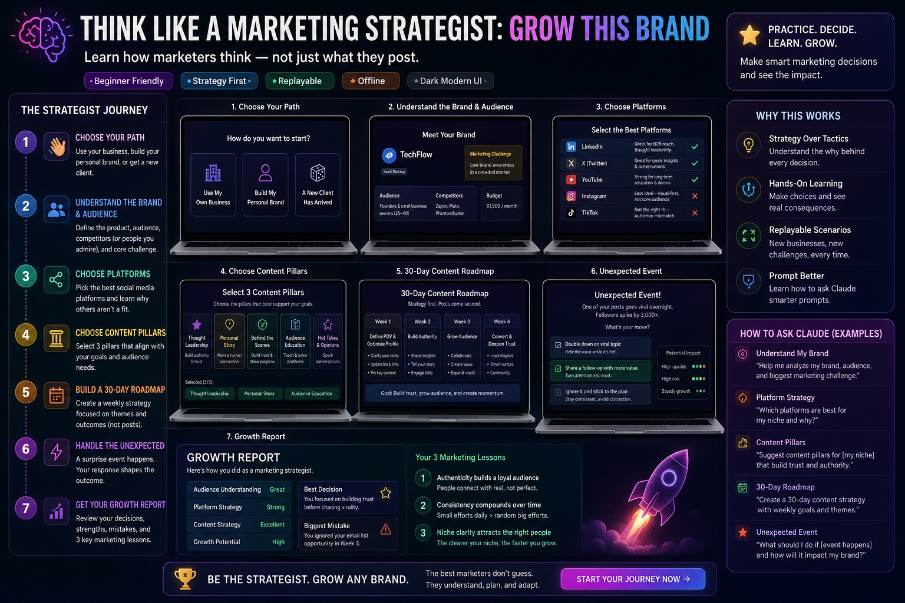
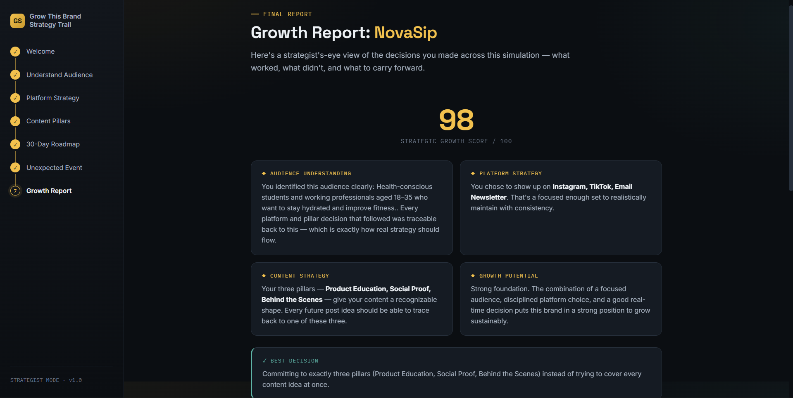

# Day 32 - AI Supply Chain Control Tower

## Project Overview
Today I built an AI Supply Chain Control Tower, an interactive dashboard that simulates the experience of managing global supply chain operations.

## Features
- Real-time KPI Dashboard
- Inventory Monitoring
- Shipment Tracking
- Warehouse Performance
- Supplier Risk Analysis
- AI Insights Panel
- Demand Forecast Visualization
- Responsive UI
- Interactive Charts and Metrics
- Modern Glassmorphism Design

## Technologies Used
- HTML5
- CSS3
- Vanilla JavaScript

## Key Learnings
- Designing enterprise-level dashboards
- Creating responsive layouts using CSS Grid and Flexbox
- Building reusable UI components
- Simulating real-time operational data
- Improving dashboard UX and visual hierarchy
- Working with interactive JavaScript elements
- Developing complex single-file web applications

## Screenshots
- Dashboard Poster 
- Screenshot 
- HTML File [Original HTML](day32-htmlfile.html)

## Outcome
This project helped me understand how modern supply chain control towers provide operational visibility, monitor logistics, and support AI-driven decision making.
