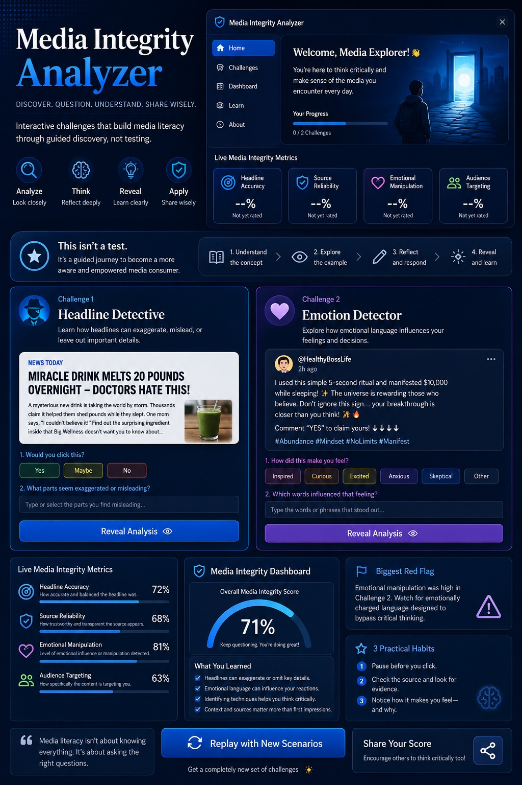
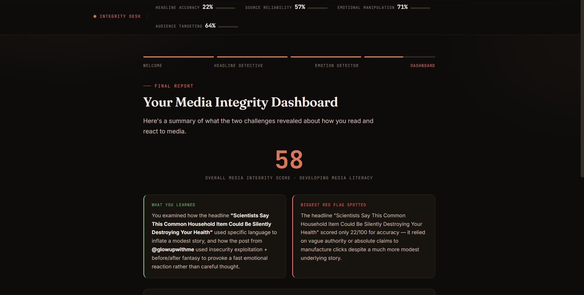

# Day 33 - AI Project Challenge

## 📌 Project Overview
Today I built an interactive AI-powered web application using HTML, CSS, and JavaScript. The project focuses on creating a modern user interface with responsive design, interactive components, and a clean user experience.

## 🚀 Technologies Used
- HTML5
- CSS3
- JavaScript (Vanilla)

## ✨ Key Features
- Responsive Layout
- Modern Dashboard UI
- Interactive Components
- Real-time User Interactions
- Clean & Professional Design

## 📚 Key Learnings
- Improved HTML page structure
- Better CSS layout techniques
- JavaScript DOM manipulation
- Event handling
- UI/UX design principles
- Responsive web development
- Code organization and optimization

## 📂 Files Included
- day33.htmlfile [Original HTML](day33-htmlfile.html)
- Poster 
- Screenshots 

## ✅ Outcome
Successfully completed Day 33 challenge and uploaded the project to GitHub.
