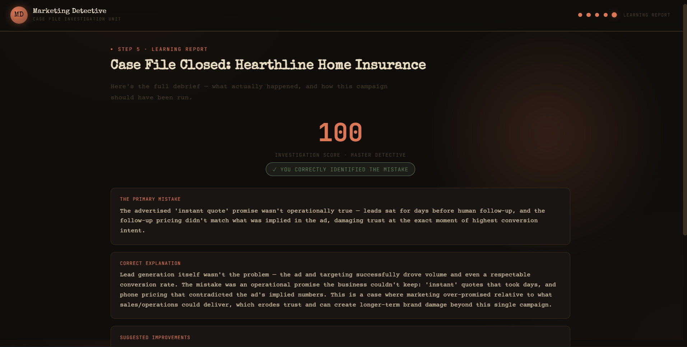
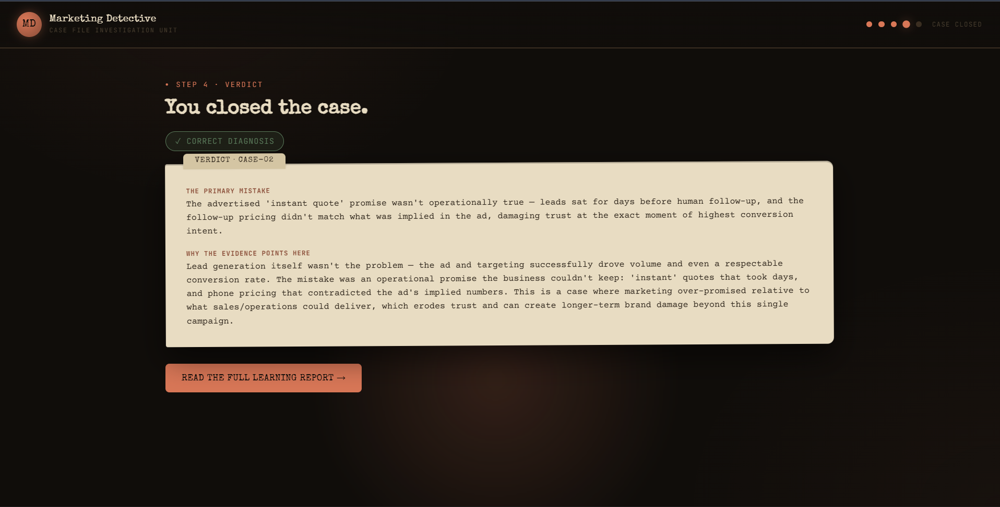

# Day 34 – Claude Challenge: Marketing Detective

## 📌 Project Title
**Marketing Detective – Interactive Marketing Investigation Game**

## 🚀 Overview
Today I built a premium single-page web application called **Marketing Detective**. The application transforms marketing analysis into an engaging detective-style investigation where users solve fictional marketing campaign failures by analyzing clues, campaign metrics, customer feedback, and social media performance.

The experience follows a detective game rather than a traditional dashboard, making learning marketing concepts interactive and enjoyable.

---

## ✨ Features

- Premium Detective UI
- Dark Theme with Orange Glow
- Responsive Design
- Random Marketing Cases
- Interactive Investigation Board
- Draggable Evidence
- Progress Tracker
- Case Assignment Screen
- Solve the Case Challenge
- Case Closed Animation
- Learning Report
- Animated Charts
- Replay with New Case
- Theme Selection (including Claude Orange)

---

## 🛠 Technologies Used

- HTML5
- CSS3
- JavaScript (Vanilla)
- React (CDN)
- Babel
- SVG Icons
- CSS Animations

---

## 📂 Project Structure

```
Day34/
│
├── MarketingDetective.html
├── screenshot1.png
├── screenshot2.png
└── poster.png
```

---

## 📸 Screenshots

Included:

- HTML FILE [Original HTML](day34-htmlfile.html)
- Investigation Board 
- Solve the Case 

---

## 🎯 Key Learnings

- Building interactive single-page applications.
- Creating reusable React components.
- Designing immersive game-like user experiences.
- Implementing drag-and-drop interactions.
- Managing application state effectively.
- Creating responsive layouts using CSS.
- Building animated progress indicators.
- Using fictional datasets for interactive learning.
- Improving UI with smooth transitions and visual hierarchy.
- Designing engaging educational experiences through gamification.

---

## ✅ Completion Checklist

- [x] Created Day34 folder
- [x] Added day34.md
- [x] Uploaded HTML project
- [x] Uploaded screenshots
- [x] Uploaded project poster
- [x] Committed changes
- [x] Pushed to GitHub
- [x] Submitted GitHub Commit URL

---

## 🔗 GitHub Commit URL

Paste your GitHub Commit URL here after pushing your project.

```
https://github.com/your-username/your-repository/commit/xxxxxxxxxxxxxxxx
```

---

## 💡 Reflection

This challenge helped me combine frontend development, UX design, and marketing concepts into an engaging detective-themed learning experience. I gained hands-on experience in building polished interactive interfaces, implementing game mechanics, and presenting complex marketing data in a fun, user-friendly way.
