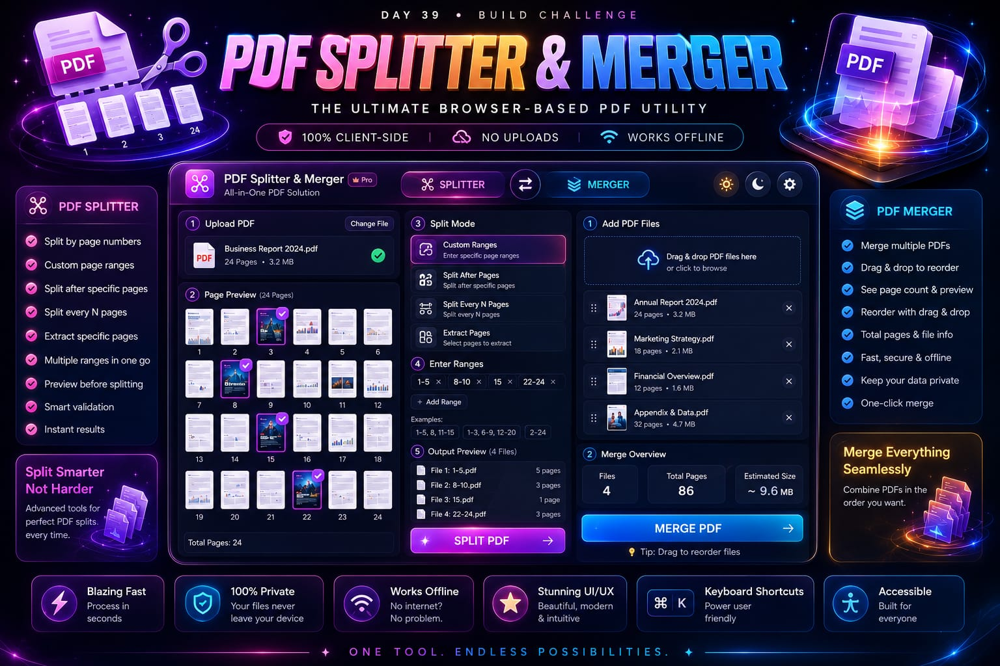
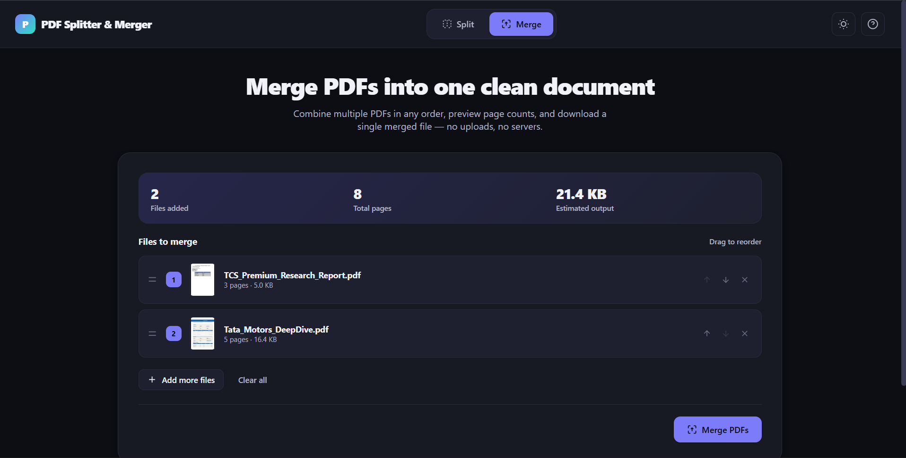

# 🚀 Day 39 - Claude AI Mastery Challenge

## 📌 Project Title
PDF Splitter & Merger

## 🎯 Objective
Built a premium browser-based PDF utility application using Claude AI.

The application allows users to:
- Split PDF files using multiple methods
- Merge multiple PDF documents
- Preview PDF pages before processing
- Extract selected pages
- Create custom page ranges
- Reorder PDFs using drag and drop

## 🛠️ Technologies Used

- HTML5
- CSS3
- JavaScript
- PDF.js
- PDF-Lib

## ✨ Features Implemented

### PDF Splitter
✅ Upload PDF files  
✅ Automatic page detection  
✅ Page thumbnail preview  
✅ Custom page ranges  
✅ Split after selected pages  
✅ Split every N pages  
✅ Extract selected pages  
✅ Output structure preview  

### PDF Merger
✅ Multiple PDF upload  
✅ Drag & drop support  
✅ File reordering  
✅ Page count calculation  
✅ PDF merging  
✅ Download merged PDF  

## 🔒 Privacy Features

- 100% client-side processing
- No server upload
- Works directly inside browser

## 🎨 UI/UX Features

- Modern premium interface
- Responsive design
- Dark mode
- Loading animations
- Error handling
- Keyboard shortcuts
- Accessibility support

## 📚 Key Learnings

- Learned browser-based PDF processing
- Improved JavaScript file handling skills
- Used PDF.js for document rendering
- Used PDF-Lib for PDF manipulation
- Created professional UI workflows with AI assistance

## Files Included 
- HTML FILE [Original HTML](day39-htmlfile.html)
- POSTER 
- SCREENSHOT 

## 🏆 Challenge Outcome

Successfully created a complete PDF management tool with Claude AI assistance as part of the 60-Day Claude AI Mastery Challenge.

---

Created by:
**Anurag Dixit**
