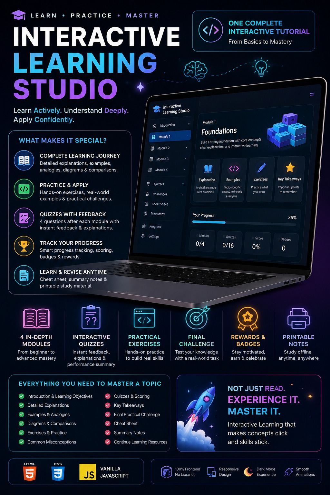
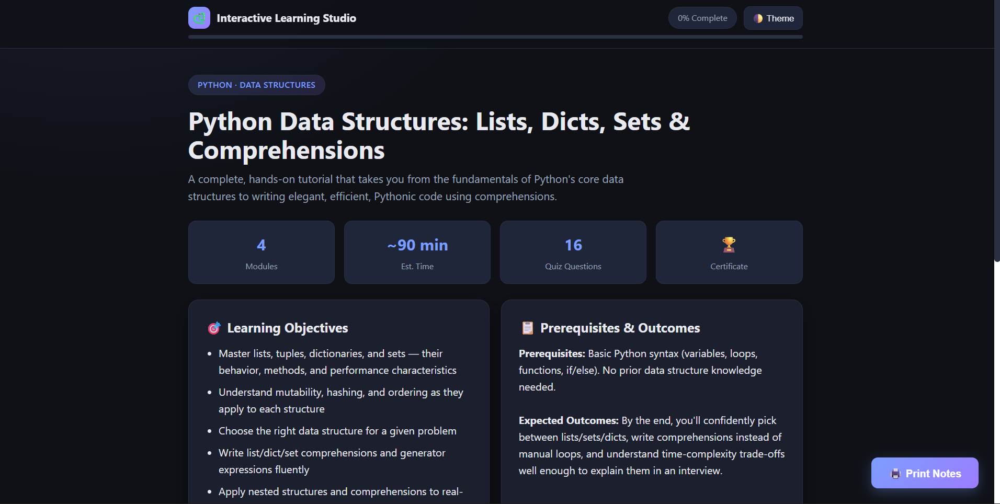

# 🚀 Day 41 - Claude AI Mastery Challenge

## 📌 Project Title
(Add your Day 41 project title here)

## 🎯 Objective
Built a responsive web application using Claude AI with a focus on UI design, functionality, and user experience.

## 🛠️ Technologies Used

- HTML5
- CSS3
- JavaScript
- Tailwind CSS (if used)
- Claude AI

## ✨ Features

- Responsive design
- Interactive user interface
- Modern UI components
- Smooth user experience
- AI-assisted development

## 📸 Files

- Added HTML FILE
-  [Original HTML](day41-htmlfile.html)
- Added POSTER
- 
- Added ScreenShot
- 

  

## 📚 Key Learnings

- Learned how to use Claude AI effectively for building applications.
- Improved prompt engineering skills.
- Learned better UI/UX design approaches.
- Improved HTML, CSS, and JavaScript implementation skills.
- Understood how AI tools can accelerate development.

## 🔗 Project Files

Generated HTML file is included in this folder.

## ✅ Conclusion

Day 41 challenge helped me improve my AI-assisted development workflow and frontend development skills.
