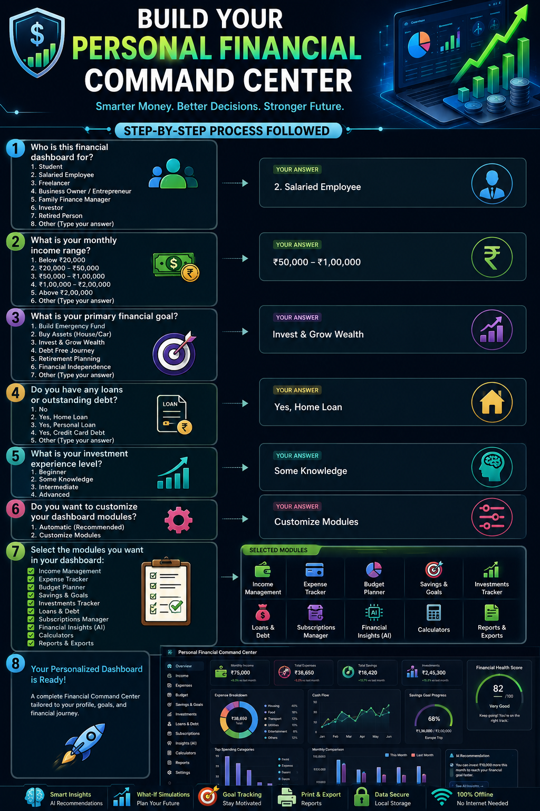
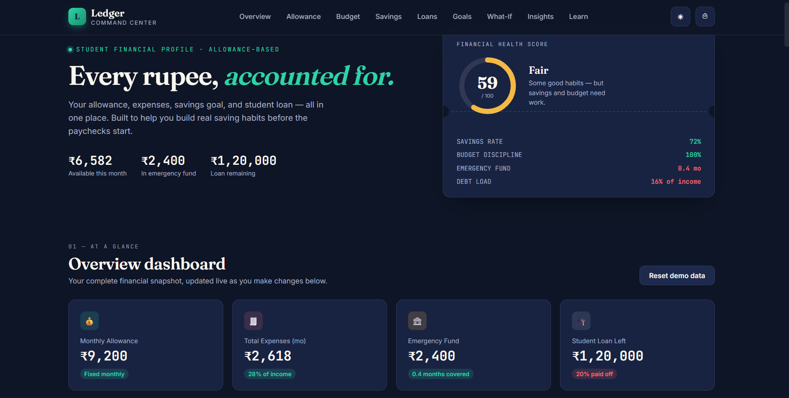

# 🚀 Day 42 - Claude AI Mastery Challenge

## 📌 Project Title
Personal Financial Command Center

## 🎯 Objective
Created a premium AI-powered financial management dashboard that helps users analyze, manage, and improve their financial health.

The application is designed as a complete financial command center instead of a simple expense tracker. It provides personalized insights, financial planning tools, interactive visualizations, and smart recommendations.

---

## 🛠️ Technologies Used

- HTML5
- CSS3
- JavaScript
- Local Storage
- Responsive Web Design
- Claude AI (Prompt Engineering)

---

## ✨ Key Features

✅ Personalized Financial Profile Setup  
✅ Interactive Financial Dashboard  
✅ Income & Expense Management  
✅ Budget Planning System  
✅ Savings & Goal Tracking  
✅ Investment Tracking  
✅ Loan & Debt Management  
✅ Subscription Management  
✅ Financial Health Score  
✅ AI-Based Financial Recommendations  
✅ What-If Financial Simulations  
✅ Interactive Charts & Data Visualization  
✅ Dark Mode Support  
✅ Printable Financial Reports  
✅ Offline Browser Storage  

---

## 🧠 AI Prompt Engineering Approach

Used Claude AI to:

- Analyze financial dashboard requirements
- Generate application architecture
- Design user-friendly UI/UX
- Create responsive frontend components
- Improve feature planning and user experience
- Generate ideas for financial insights and simulations

---

## 📚 What I Learned

- How to create complex web applications using AI assistance.
- How to convert real-world problems into digital solutions.
- Importance of user personalization in application design.
- Building responsive and interactive dashboards.
- Implementing browser-based data storage using JavaScript.
- Creating professional UI designs with better user experience.
- Using AI tools for faster development and innovation.
- Improving prompt engineering techniques.
- Managing projects and documentation using GitHub.

---

## 📸 Project Added File

- Added HTML FILE
- [Original HTML](day42-htmlfile.html)
- Added POSTER
- 
- Added SCREEN SHOT
- 
---

## 📂 Project Structure
