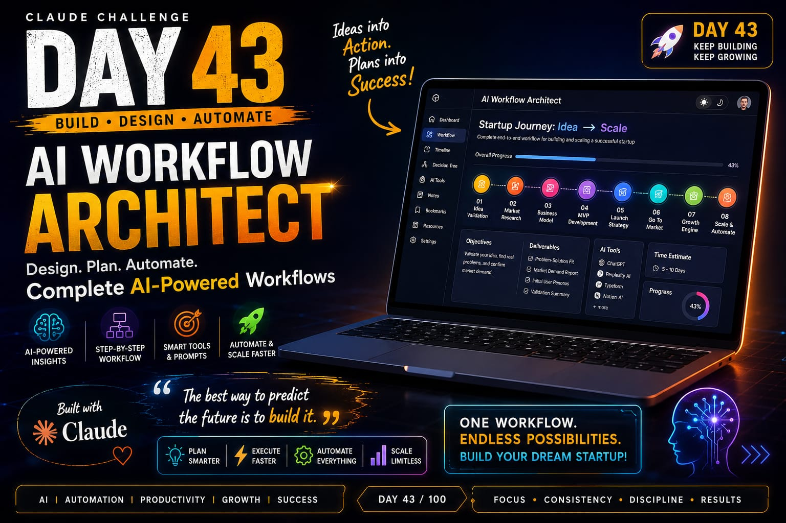
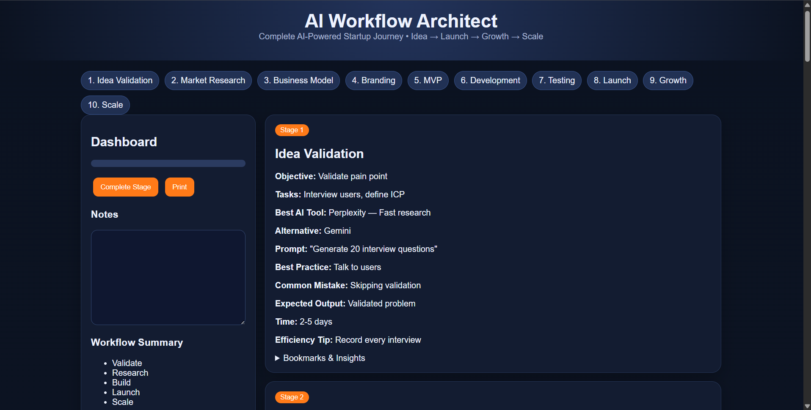

# 🚀 Day 43 - Claude AI Mastery Challenge

## 📌 Project Title
[Add Your Project Name Here]

## 🎯 Objective

The objective of this challenge was to build a practical AI-powered application using Claude AI and improve my prompt engineering, UI/UX design, and development skills.

## 🛠️ Technologies Used

- Claude AI
- HTML
- CSS
- JavaScript
- Tailwind CSS
- AI Prompt Engineering

## ✨ Features Implemented

- User-friendly interface
- Responsive design
- Interactive components
- AI-generated solutions
- Offline functionality

## 📸 File Included

- Added HtmlFile - 
- [Original HTML](day43-htmlfile.html)
- Added Poster - 
- 
- Added ScreenShot - 
- 

## 🧠 Key Learnings

- Learned how to create effective prompts for Claude AI.
- Improved my ability to convert ideas into functional applications.
- Learned better UI/UX practices.
- Understood how AI can accelerate software development.
- Improved GitHub project documentation skills.

## ✅ Challenge Status

Completed successfully 🎉
