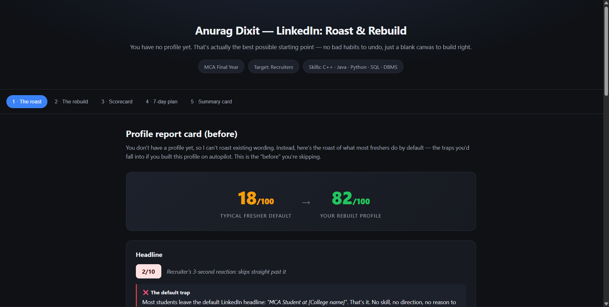
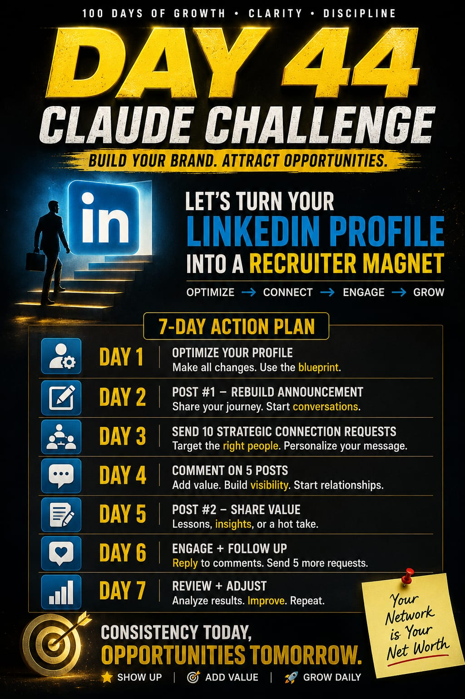

# 🚀 Day 44 - Claude AI Mastery Challenge

## 📌 Project Title
Build an AI-Powered LinkedIn Profile Optimizer

## 🎯 Objective
The objective of this project was to build an AI-powered solution using Claude AI and improve my skills in prompt engineering, AI-assisted development, and modern web application creation.

## 🛠️ Technologies Used

- Claude AI
- HTML
- CSS
- JavaScript
- AI Prompt Engineering
- Git & GitHub

## ✨ Features Implemented

- User-friendly interface
- Responsive design
- AI-assisted functionality
- Interactive components
- Modern UI/UX experience

## 📸 Screenshots

Screenshots of the completed project are uploaded in this folder.

## 📂 Project Files

- Generated HTML file [Original HTML](day44-htmlfile.html)
- Screenshot 
- Poster  

## 🧠 Key Learnings

- Improved prompt engineering skills with Claude AI.
- Learned how to convert AI ideas into functional web applications.
- Enhanced frontend development and UI design skills.
- Practiced GitHub repository management and documentation.
- Learned better ways to structure AI-generated projects.

## 🔗 GitHub Repository

Added this project as part of my 60-Day Claude AI Mastery Challenge.

## ✅ Completion Checklist

✔ Created Day44 folder  
✔ Added day44.md file  
✔ Uploaded screenshots  
✔ Uploaded generated HTML file  
✔ Committed changes  
✔ Pushed changes to GitHub
