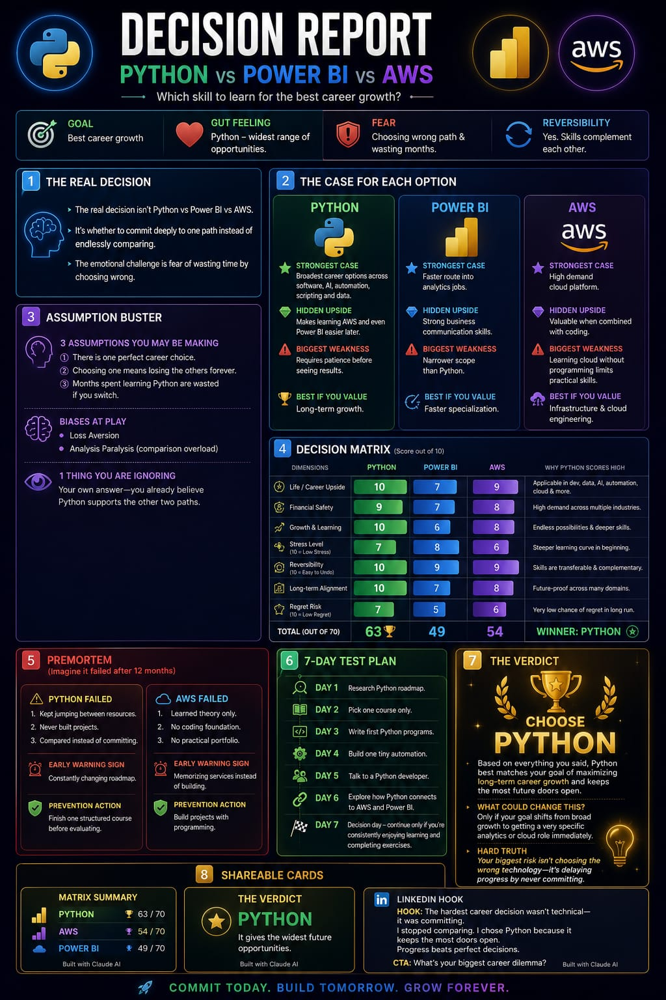
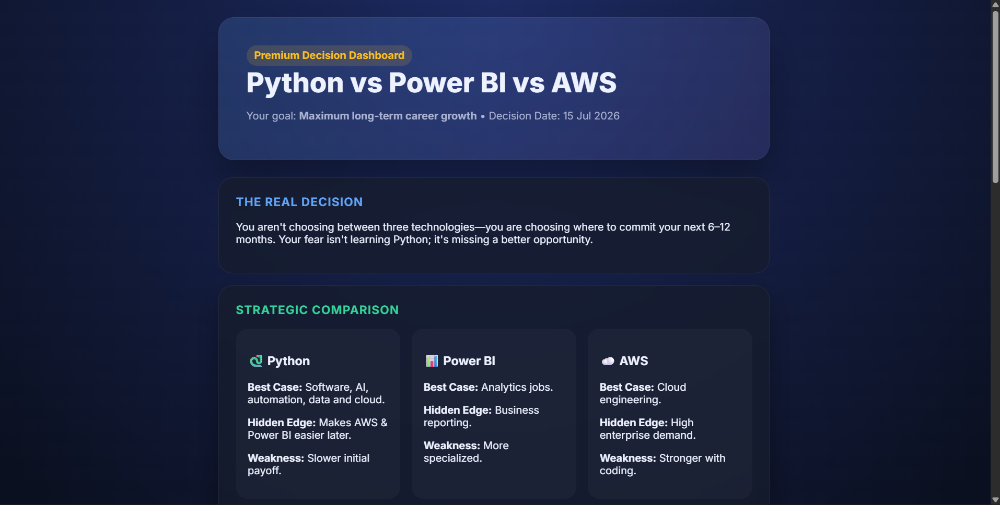

# 🚀 Day 45 – Claude AI Mastery Challenge

## 📌 Project Title
Decision Strategist – Smart Career Decision Support System

## 🎯 Objective
Built an AI-powered Decision Strategist that helps users make informed career decisions by comparing multiple learning paths based on their goals, interests, risks, and long-term growth opportunities.

---

## 🛠️ Technologies Used

- HTML5
- CSS3
- JavaScript (ES6)
- Claude AI
- Prompt Engineering

---

## ✨ Features

- Interactive career decision assistant
- Compares multiple career paths
- Decision matrix with scoring system
- Risk vs Reward analysis
- Long-term career growth comparison
- Personalized recommendations
- Clean and responsive UI
- Fully browser-based (No backend required)

---

## 📂 Files Included

- `index.html`
- Screenshots
- `day45.md`

---

## 📸 files included

- Home Screen file [Original HTML](day45-htmlfile.html)
- Decision Analysis Poster 
- Recommendation Results Screenshot 

---

## 📚 Key Learnings

- Learned how AI can assist in structured decision-making.
- Improved prompt engineering techniques.
- Built an interactive decision-support interface.
- Understood trade-offs between different career paths.
- Practiced creating responsive web applications.
- Enhanced problem-solving and logical thinking skills.

---

## 🚀 Outcome

Successfully created an AI-powered Decision Strategist capable of helping users evaluate multiple career options using logical comparisons and personalized recommendations.

## ✅ Status

✔ Day 45 Completed Successfully
