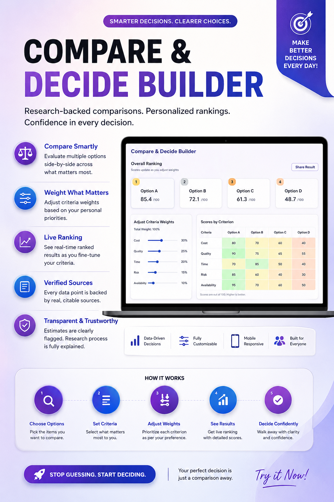
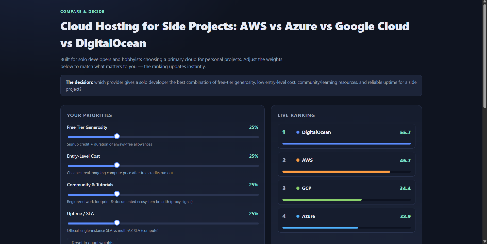

# Day 48 – Compare & Decide Builder

## 📅 Date

18 July 2026

## 🚀 Challenge

Built a **Compare & Decide Builder**—a research-backed decision support application that compares multiple options using customizable weighted criteria and transparent data sources.

## 🎯 Objective

Develop a premium single-file HTML application that enables users to compare alternatives, assign custom importance (weights) to decision criteria, and receive a live ranked recommendation based on verified research data.

## ✨ Features

* Interactive comparison interface
* Adjustable criteria weights
* Real-time ranking updates
* Research-backed comparison data
* Visible sources and citations panel
* Estimated data clearly flagged
* Responsive modern UI
* Loading, empty state, and error handling
* Collapsible "How this was researched" section
* Single-file HTML implementation

## 🛠️ Technologies Used

* HTML5
* CSS3
* JavaScript (Vanilla)
* Responsive Design
* Flexbox
* CSS Grid

## 📂 Files Uploaded

* compare_decide_builder.html [Original HTML](day48-htmlfile.html)
* Poster 
* Screenshots 
  


## 📊 Sourced Data Report

The application uses verified and citable sources wherever available.

Each comparison includes:

* Data source
* Citation
* Last updated information
* Estimated values (if applicable)
* Transparency notes

## 📚 Key Learnings

* Designing weighted decision-making systems
* Building dynamic ranking algorithms
* Creating responsive UI without external libraries
* Presenting transparent research methodology
* Handling real-world data uncertainty
* Improving frontend architecture using vanilla JavaScript
* Building production-style interactive tools

## 🎯 Outcome

Successfully created a professional comparison application that combines research-backed information with customizable decision logic, helping users make informed choices confidently.

---

### Git Commit Message

```
Day48: Added Compare & Decide Builder with weighted ranking, research sources, responsive UI, screenshots, sourced data report, and documentation
```
