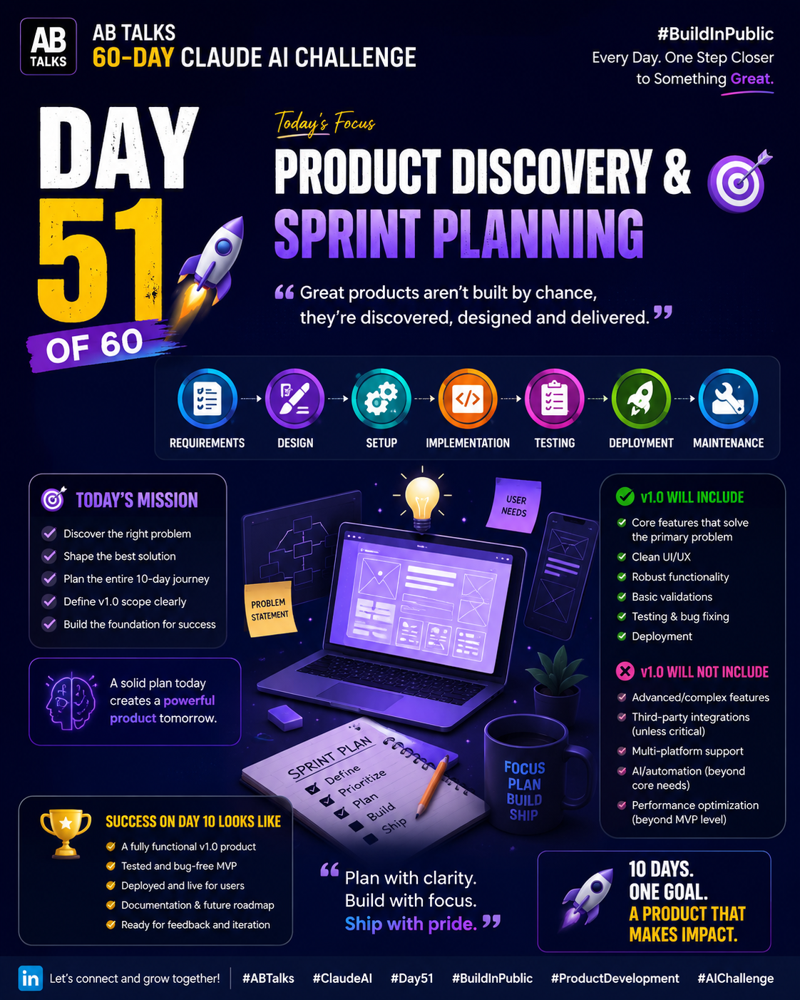
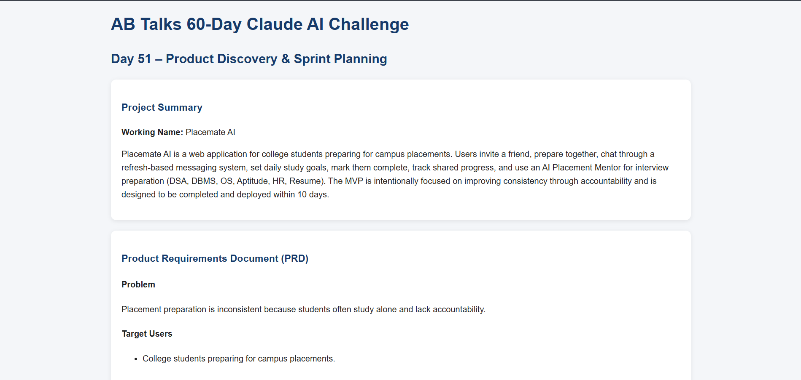

# Day 51 – Product Discovery & Sprint Planning

## 📅 Date
21 July 2026

## 🎯 Challenge
Product Discovery & Sprint Planning

## 📌 Objective
Design a product from idea to execution by defining the problem, identifying users, planning MVP features, and creating a 10-day implementation roadmap.

---

## 📂 Deliverables

- ✅ Product Requirements Document (PRD)
- ✅ Implementation Blueprint
- ✅ Pitch Deck
- ✅ Screenshots
- ✅ Key Learnings

---

## 📄 Files Included

- Implementation_Blueprint.pdf [Original HTML](day51-htmlfile.html)
- Pitch_Deck.Poster 
- Screenshots 

---

## 🚀 Key Learnings

- Importance of identifying the real user problem.
- Defining MVP scope before development.
- Prioritizing features using sprint planning.
- Creating a structured implementation roadmap.
- Building with user feedback in mind.

---

## 🛠️ Skills Practiced

- Product Discovery
- Sprint Planning
- Product Management
- Requirement Analysis
- MVP Planning
- Roadmap Design
- Documentation

---

## 🎯 Outcome

Completed the product planning phase with a clear roadmap for building the MVP over the next 10 days.

---

#ABTalks #ClaudeAI #Day51 #BuildInPublic
