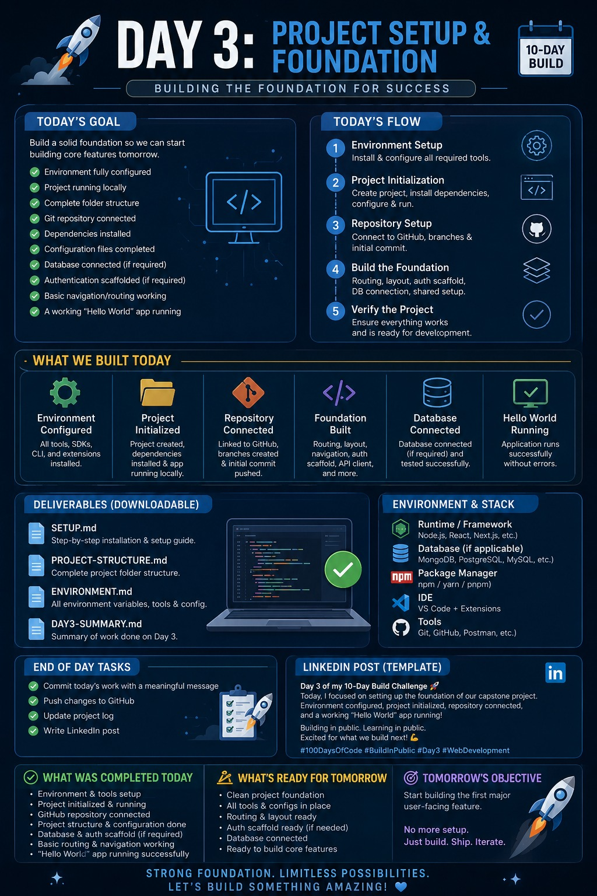

# Day 53 – Project Setup & Foundation

## 🚀 Overview

Today's goal was to establish a strong foundation for the capstone project before beginning feature development. Rather than jumping directly into building functionality, I focused on configuring the development environment, organizing the project structure, and ensuring the application was ready for rapid development in the coming days.

A well-prepared project saves time, reduces future bugs, and makes collaboration significantly easier.

---

## 🎯 Objectives

* Configure the complete development environment
* Initialize the project
* Install required dependencies
* Organize the folder structure
* Connect the Git repository
* Configure environment files
* Set up the application foundation
* Run the project successfully

---

## Poster 

  

## 🛠️ What I Worked On

### Environment Setup

* Configured the required development tools
* Installed project dependencies
* Verified runtime and package manager
* Prepared configuration files

### Project Initialization

* Created the project
* Installed all required packages
* Verified successful project startup
* Confirmed development server was running correctly

### Repository Setup

* Connected the local project with GitHub
* Initialized version control
* Prepared the project for future commits and collaboration

### Application Foundation

* Organized the folder structure
* Configured routing and navigation
* Created the base application layout
* Added shared configuration files
* Prepared the project architecture for scalable development

### Verification

* Application builds successfully
* Development server runs without errors
* Project structure matches the planned architecture
* Foundation is ready for feature implementation

---

## 📚 Key Learnings

Today's work reinforced an important lesson:

> **A strong foundation is one of the most valuable investments in any software project.**

Taking time to properly organize the project now will make future development faster, cleaner, and easier to maintain.

I also gained a better understanding of:

* Project initialization workflow
* Dependency management
* Development environment configuration
* Git repository setup
* Organizing scalable project structures

---

## ✅ Progress Summary

* ✔ Development environment configured
* ✔ Project initialized
* ✔ Dependencies installed
* ✔ Git repository connected
* ✔ Folder structure organized
* ✔ Base application configured
* ✔ Routing foundation prepared
* ✔ Development server running successfully

---

## 🎯 Next Steps

With the project foundation complete, the setup phase is officially finished.

Tomorrow, I'll begin implementing the **first major user-facing feature**, using today's architecture as the base for future development.

The exciting part starts now. 🚀

---

## 💡 Quote of the Day

> **"Build the foundation carefully, and every feature becomes easier to create."**
