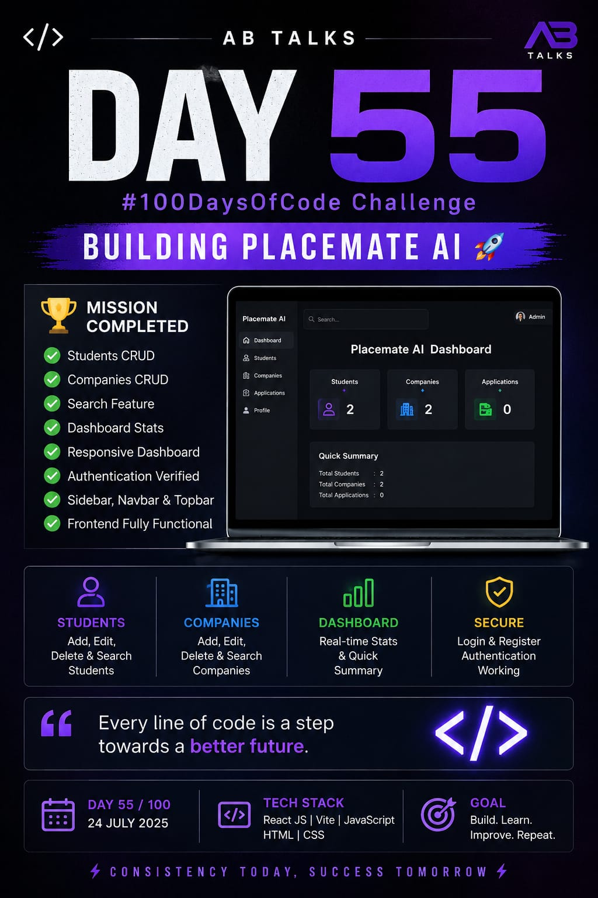

# Day 55 - AB Talks Claude AI Challenge

## Project
Placemate AI

## What I Completed Today

### Dashboard
- Improved Dashboard UI
- Added Statistics Cards
- Added Quick Summary
- Responsive Layout

### Students Module
- Add Student
- Edit Student
- Delete Student
- Search Student
- Total Students Counter

### Companies Module
- Add Company
- Edit Company
- Delete Company
- Search Company
- Total Companies Counter

### Authentication
- Login Working
- Register Working
- Protected Routes Verified

### Navigation
- Navbar
- Sidebar
- Topbar

## Technologies Used
- React.js
- Vite
- JavaScript
- HTML
- CSS

## Learning
- React State Management
- CRUD Operations
- Search Filtering
- Component Reusability
- Dashboard Design
- Git & GitHub Workflow

## Files and Screenshots
- Dashboard Screenshot 
- Poster 

## Git Commit
Day 55 Completed

## Status
✅ Day 55 Successfully Completed

Next Goal:
Complete the Applications Module and Profile Module while continuing to improve the Placement AI project.
