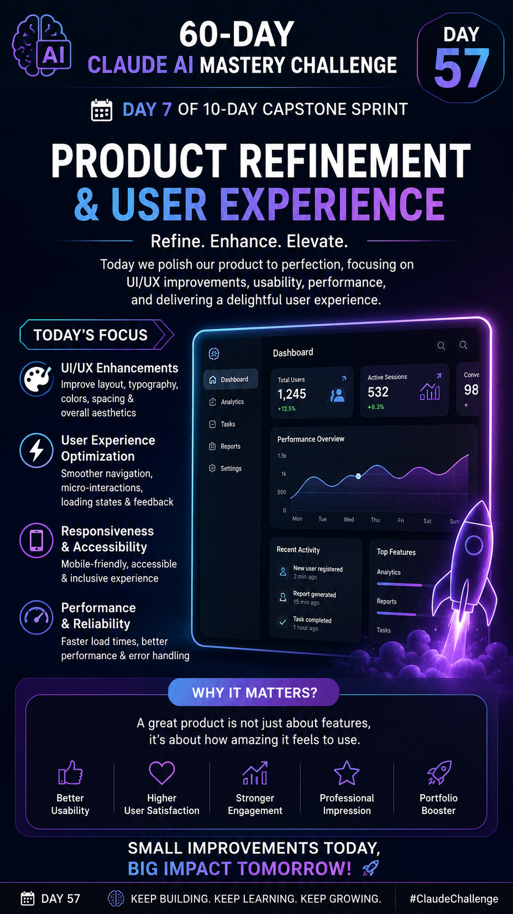
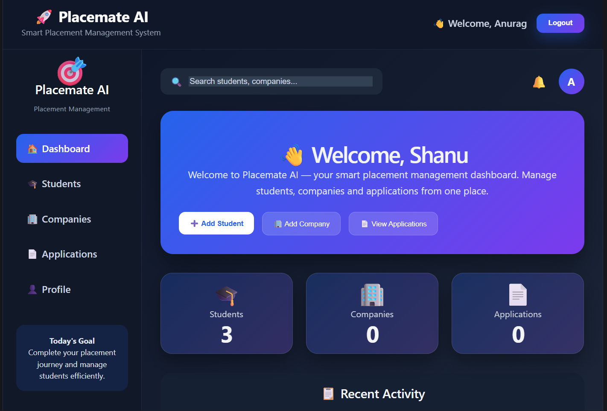
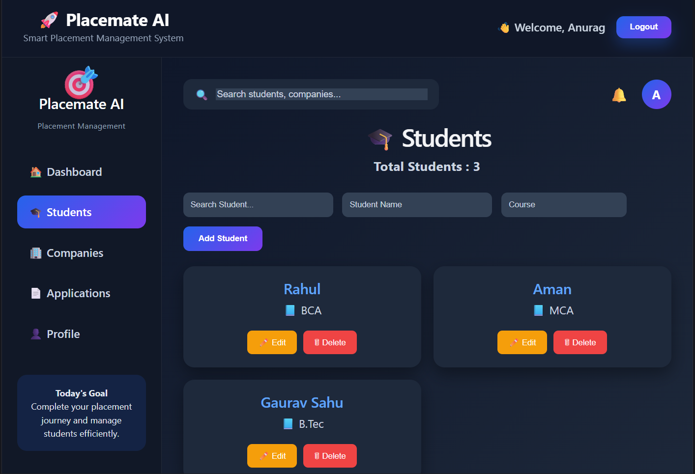
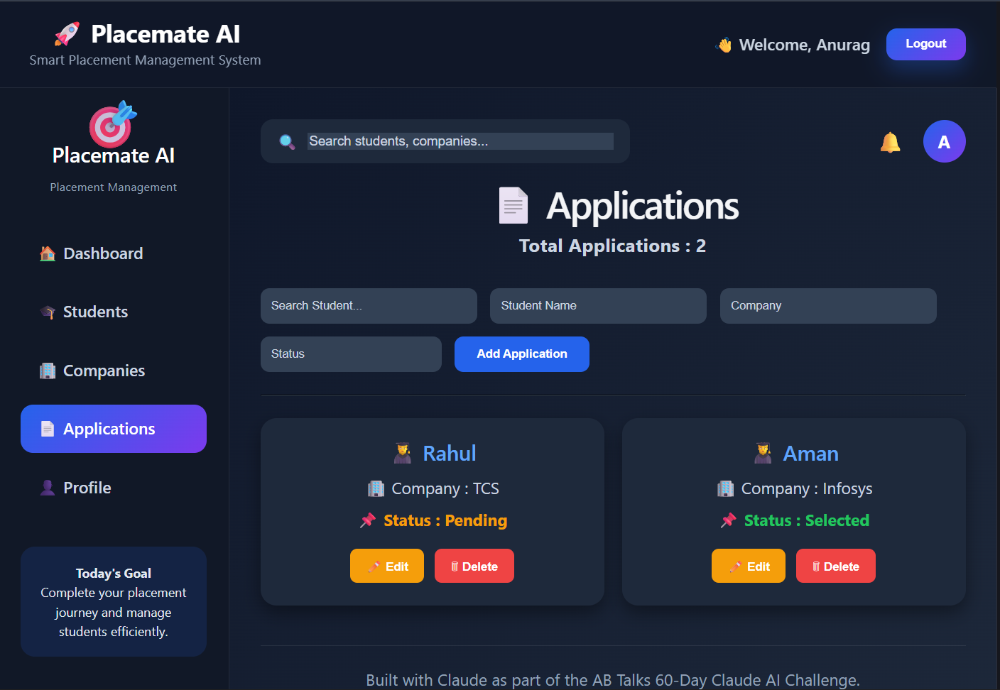

# Day 57 – Product Refinement & User Experience

## 📅 Challenge

**60-Day Claude AI Mastery Challenge – Day 57**

## 🎯 Objective

Refine the MVP by improving the overall user experience, interface consistency, responsiveness, accessibility, and application performance while keeping the core product vision unchanged.

---

# ✅ Tasks Completed

### 1. Continued the Capstone Project

* Continued development from the previous sprint.
* Reviewed the existing MVP before starting refinements.

### 2. Product Review

* Evaluated the application's UI and UX.
* Identified areas for improvement without changing the core functionality.

### 3. UI Refinements

* Improved layout consistency.
* Enhanced spacing and alignment.
* Updated typography for better readability.
* Improved color consistency.
* Refined buttons and interactive components.

### 4. User Experience Improvements

* Improved navigation flow.
* Enhanced responsiveness for mobile, tablet, and desktop.
* Added better visual feedback for user actions.
* Improved accessibility across components.

### 5. Better Application States

Implemented improvements for:

* Loading States
* Empty States
* Error States
* Success Messages

### 6. Performance Optimization

* Reduced unnecessary renders.
* Optimized assets.
* Improved page loading performance.

### 7. Quality Assurance

Verified that all existing features continued working correctly after refinements.

---

# 📁 Files Added

```
Day57/
│
├── DAY7-SUMMARY POSTER
├── screenshots/
│   ├── screenshot1.png
│   ├── screenshot2.png
│   ├── screenshot3.png
```

---

# 📷 Screenshots

Included:
* Poster 
* Screenshot 
* Screenshot 
* Screenshot 


---

# 📚 Key Learnings

* Small UI improvements create a much better user experience.
* Consistent spacing and typography improve usability.
* Accessibility should be considered from the beginning.
* Responsive layouts are essential for production-ready applications.
* Loading and error states significantly improve perceived quality.
* Micro-interactions make interfaces feel more polished and engaging.
* Performance optimization enhances overall user satisfaction.

---

# 📌 Deliverables

* ✅ Product reviewed
* ✅ UI refined
* ✅ UX improved
* ✅ Responsive design enhanced
* ✅ Accessibility improvements completed
* ✅ Loading/Error/Empty states improved
* ✅ Performance optimized
* ✅ Documentation updated
* ✅ Screenshots added
* ✅ GitHub repository updated

---

## 🎯 Day 8 Preview

The next sprint focuses on final polish, comprehensive testing, bug fixing, production readiness, deployment verification, and preparing the application for a professional portfolio showcase.
