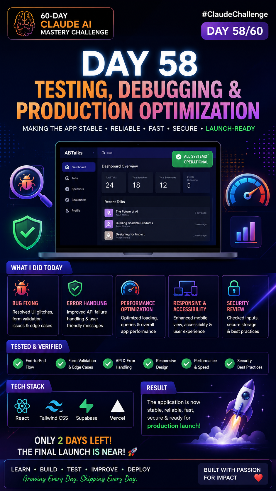
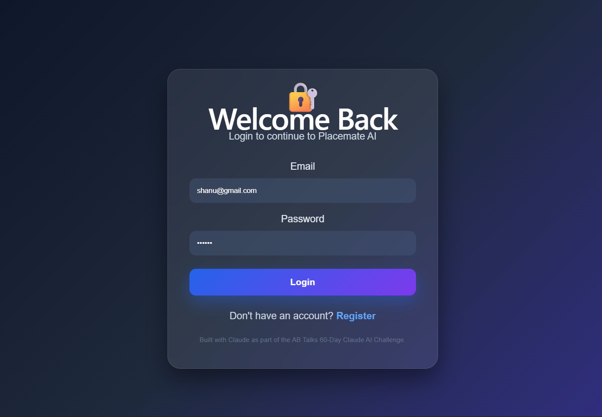
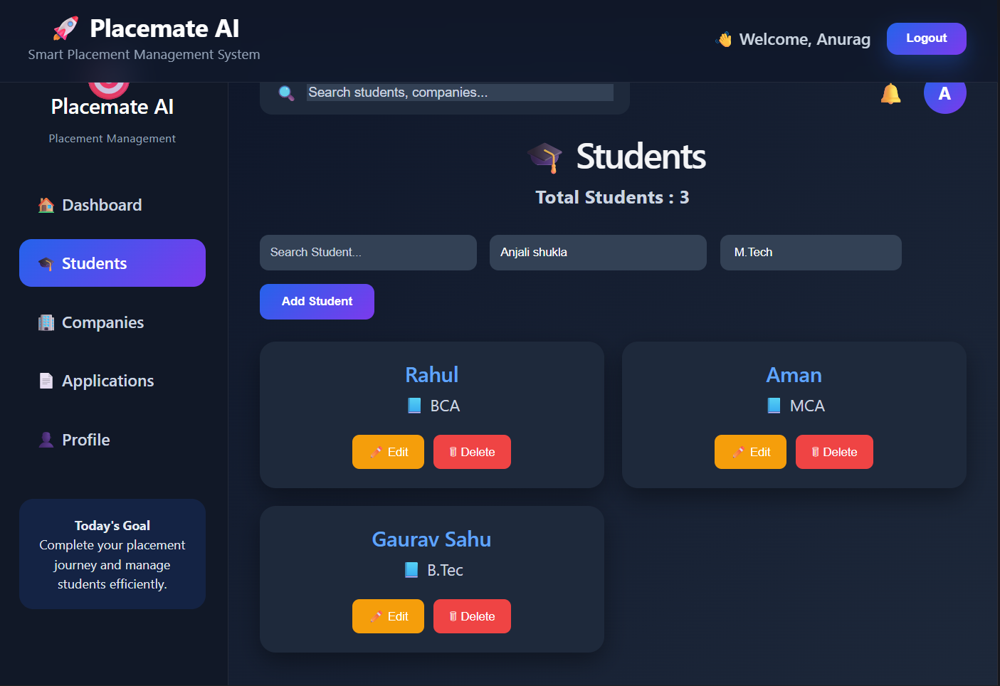

# Day 58 – Complete MVP Walkthrough & Documentation

## ✅ Tasks Completed
- End-to-end testing completed
- Login/Register verified
- Dashboard verified
- Students CRUD verified
- Companies CRUD verified
- Applications CRUD verified
- Profile verified
- Protected Routes tested
- LocalStorage persistence verified
- Form validation verified
- Navigation verified
- UI consistency checked

## 📸 Deliverables
- End-to-end walkthrough screenshots
- DAY8-SUMMARY.md
- Project documentation updates

## Files Added 
- Poster 
- Screenshot1 
- Screenshot2 
- Screenshot3 

  
## 📚 Key Learnings
- Improved confidence in demonstrating a complete product workflow.
- Learned how to document milestones clearly for future reference.
- Verified the application works from start to finish.
- Strengthened Git and GitHub workflow by organizing daily progress.
- Prepared the project for the final sprint and submission.
- End-to-end testing
- Debugging React applications
- CRUD verification
- LocalStorage persistence
- Production readiness checklist
- QA testing workflow

## 🚀 Status
Day 58 completed successfully.
